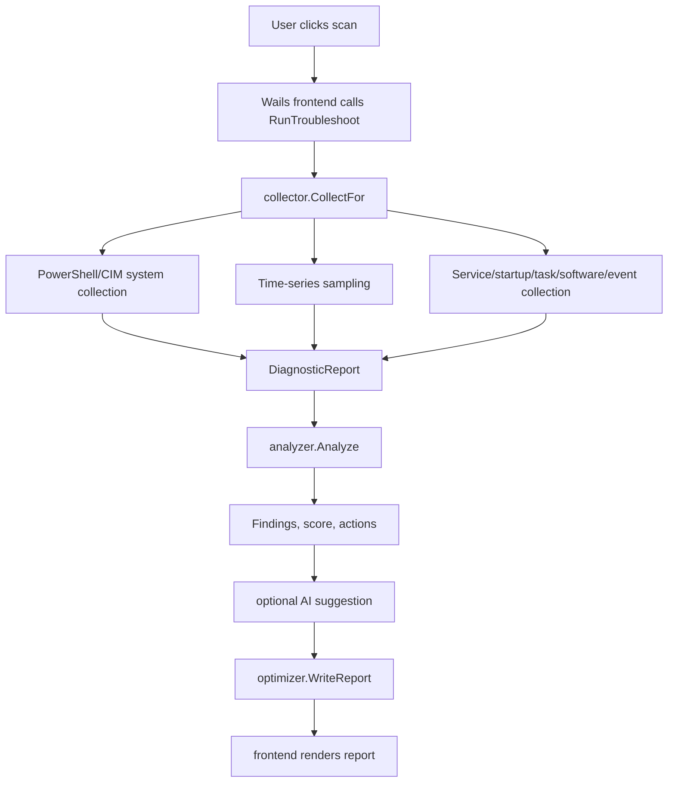

# Architecture

## Technology Choice

Diagnostic Studio uses:

- Go for system collection, rules, optimization, local logs, and API integration.
- Wails for the desktop GUI shell.
- Vanilla Vite frontend for lightweight UI.
- WebView2 on Windows.

Target executable size is well under the 100 MB limit; a comparable Wails/Go build comes out around 11 MB.

## Project Structure

```text
.
├── app.go
├── main.go
├── wails.json
├── internal
│   ├── ai
│   ├── analyzer
│   ├── collector
│   ├── model
│   └── optimizer
├── frontend
│   └── src
│       ├── main.js
│       └── style.css
├── build
└── design
```

## Runtime Data Flow



## Backend Modules

### `internal/model`

Defines shared data contracts:

- `DiagnosticReport`
- `ComputerInfo`
- `CPUInfo`
- `MemoryInfo`
- `DiskInfo`
- `SamplingSummary`
- `ProcessInfo`
- `ServiceInfo`
- `StartupItem`
- `ScheduledTask`
- `InstalledApp`
- `EventInfo`
- `AnalysisResult`
- `OptimizationAction`
- `AIConfig`

### `internal/collector`

Collects system data through PowerShell and CIM. Responsibilities:

- Admin detection.
- Computer and OS info.
- CPU info.
- Memory info.
- Disk info.
- Power state: active scheme, AC/DC processor policy (max state, boost), power source, battery wear.
- Throttle evidence: Kernel-Processor-Power firmware-limit events (ID 37), thermal zone best effort.
- Optional advanced sensors (planned M6): user-supplied HWiNFO Shared Memory
  and/or LibreHardwareMonitor helper readings normalized into temperature,
  fan RPM, package power, voltage, and throttle-flag metrics.
- Time-series system samples.
- Top processes.
- Matching services.
- Startup registry entries.
- Scheduled tasks.
- Installed applications.
- System events.
- Vendor/bundleware hints.

### `internal/analyzer`

Converts raw data into:

- Score.
- Severity.
- Primary cause — for constrained-frequency findings this comes from the root-cause attribution pass (ranked candidates with evidence), not from the first rule that fired.
- Findings.
- Recommended actions.
- Category scores.

### `internal/optimizer`

Executes manual actions and writes local logs:

- Power plan change.
- Service disable/stop — persists previous startup type and running state before the change (rollback record).
- Service rollback — restores startup type and restarts the service if it was running.
- Temp cleanup.
- Operation log.
- Diagnostic report archive.

### `internal/ai`

Stores OpenAI-compatible API config and calls `/chat/completions` when enabled.

The API key is encrypted at rest with Windows DPAPI; only Base URL, model, and the enabled flag are stored in plain config.

AI receives a reduced diagnostic summary and returns advice. It is not allowed to execute actions.

## Frontend Modules

The frontend is intentionally simple:

- `main.js`: rendering, localized copy, event handlers, Wails API calls.
- `style.css`: Diagnostic Studio visual system.
- `app.css`: kept as Wails template compatibility placeholder.

The UI currently uses plain JavaScript instead of React/Vue to keep dependencies and build size low.

## Windows-Specific Behavior

The app requests administrator rights through:

```text
build/windows/wails.exe.manifest
```

WebView2 data path is set explicitly in `main.go`:

```text
.\data\webview
```

If that path cannot be created, it falls back to:

```text
%TEMP%\diagnostic-studio\webview
```

This avoids the WebView2 error where the runtime tries to write under an unavailable administrator profile.
