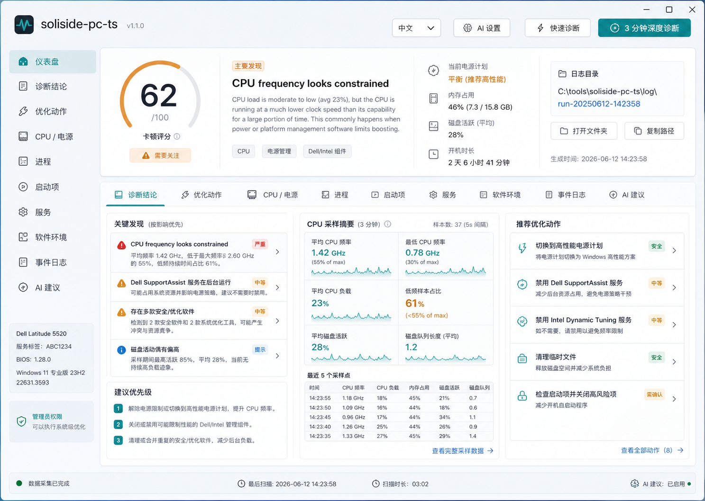
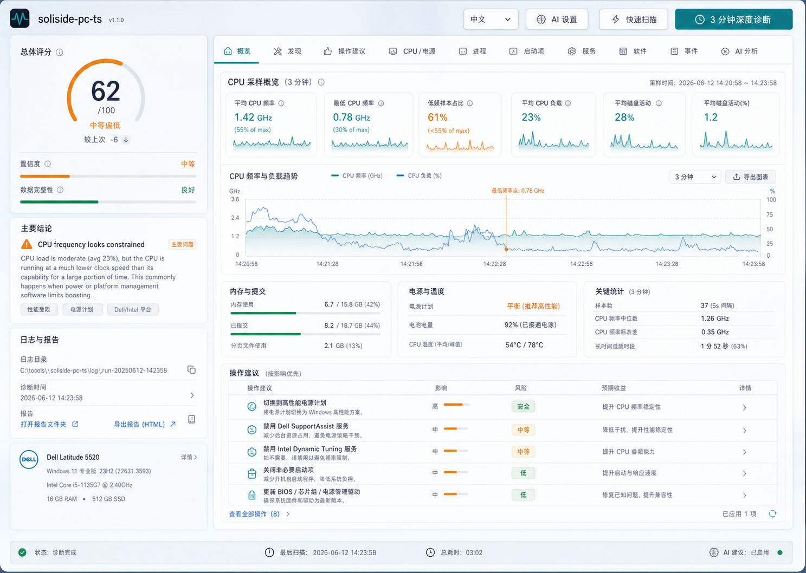
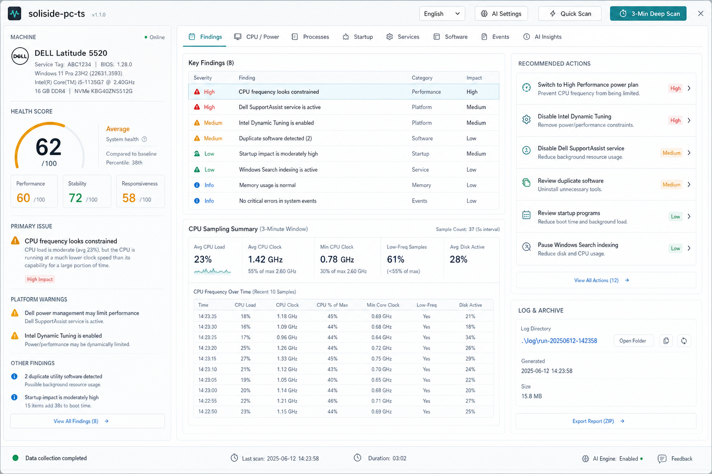

# UI Design

## Chosen Direction

The selected direction is **Diagnostic Studio**.

It is more premium than a plain admin tool, but still practical. The chosen design language uses:

- Glass-like Windows 11 surfaces.
- Teal/cyan primary accents.
- Amber warning accents.
- Light neutral background.
- Strong hierarchy between diagnosis and raw data.
- Compact but readable tables.

The intent is to feel like a careful diagnostic instrument rather than a consumer "PC optimizer".

## Prototype Options

### Option 1: Signal Console



Strengths:

- Very clear dashboard framing.
- Easy for ordinary users to understand.
- Balanced score/action layout.

Tradeoff:

- Less distinctive and less premium.

### Option 2: Diagnostic Studio



Strengths:

- Best visual polish.
- Good separation between narrative diagnosis and analysis workspace.
- Suitable for both normal and advanced users.

Tradeoff:

- Needs careful density control to avoid feeling too decorative.

### Option 3: Ops Workbench



Strengths:

- Most professional for IT/helpdesk users.
- Dense information layout.
- Strong operational feel.

Tradeoff:

- Less friendly for non-technical users.

## Target Layout

The UI follows Option 2:

- Top command bar:
  - Brand mark.
  - Product name.
  - Language dropdown.
  - AI settings.
  - Quick scan.
  - 3-minute deep scan.

- Left diagnostic panel:
  - Score.
  - Primary finding.
  - Main evidence.
  - Confidence.
  - Permission status.
  - Machine and log folder.

- Right workspace:
  - Tabs.
  - Findings list.
  - Actions.
  - CPU/power sampling.
  - Processes/startup/services/software/events.
  - AI output.

## Bilingual UI

Language switching happens in the frontend via a copy dictionary and a dropdown. The selected language persists in:

```text
localStorage["diagnostic-studio-lang"]
```

**Localization contract (MVP requirement):** the backend never emits display text for rules, findings, actions, or evidence. It emits stable IDs plus structured parameters:

- Rule/finding: `ruleId` + numeric/string params (e.g. `avgClockMHz`, `lowFreqSamplePct`, `serviceName`).
- Action: `actionId` + params + risk level enum.
- Evidence: `evidenceId` + params.

The frontend holds one zh/en copy table keyed by these IDs and formats parameters into the localized template. There is no English-title matching anywhere. Adding a language later means adding one copy table.

## Visual Rules

- Avoid marketing hero sections.
- Avoid decorative blobs or purely ornamental elements.
- Avoid nested cards.
- Use spacing, alignment, and subtle surface tint before heavy borders or shadows.
- Keep buttons compact and command-like.
- Keep tables dense but readable.
- Use status color sparingly:
  - Teal: good/primary.
  - Amber: attention/review.
  - Red: critical/high risk.

